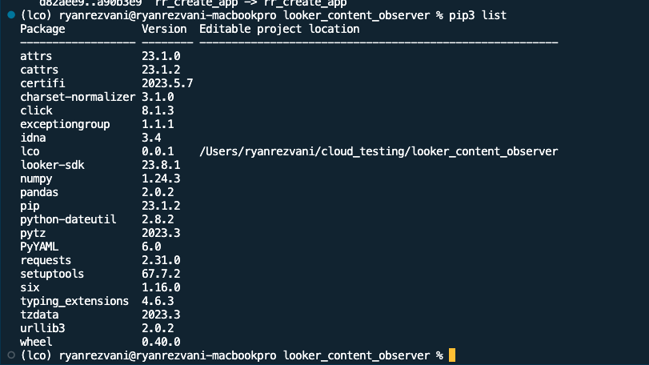

# Looker Content Observer (LCO)

## Notice

The Looker Content Observer is NOT officially supported by Looker. Please do not contact Looker support for issues with LCO. Issues may be reported via the [Issues](https://github.com/looker-open-source/looker-content-observer/issues) tracker, but no SLA or warranty exists that they will be resolved. 

## Description
This tool is intended to support the automated checking of content in Looker (dashboards and looks), and the queries which underly them. Run it pointed toward a single environment (an environment is an instance+project+branch) and find SQL or LookML errors, results of null or zero, and various formatting details like a count of dashboard filters and tiles. Run it against two environments simultaneously and compare those attritbutes, flagging differences. Use cases include:
- Quality assurance during a data warehouse or Looker instance migration
- Flagging diffs in content during a Lookml Pull Request process

## Quickstart

### [Pre-Step] looker.ini File
The Looker Content Observer leverages Looker's API to programatically check the data from dashboards. In order to accompolish this, the API credentialy will need to be set up in advance in a 'looker.ini' file.

The project includes a sample looker.ini file here: 
 - [Example of looker.ini file](looker_example.ini)
 - **Note**: The looker.ini file contains multiple sections, each section is associated with the API credentials of an individual instance.


#### Resources to Set up looker.ini File
- [See Configuring the SDK](https://developers.looker.com/api/getting-started)
- [What are INI Files](https://www.advancedinstaller.com/what-is-ini-file.html)
- [Setup User's API Credentials](https://cloud.google.com/looker/docs/api-auth)


### Install / Setup

#### [1] Create a virtual 'test' environment
```
$ virtualenv lco   
$ source lco/bin/activate         
```

#### [2] Install the 'lco' package
```
$ pip3 install --editable .  
```

#### [3] Confirm Initial Packages
Run `pip3 list`




## Demo 

### CLI Skeleton / how to run:
- Example comamnds: 
  - `lco init` : Commands here will be used to set up instances and environment
    - For the first time running the script, users should `init` as the first step
  - `lco run`: Commands here will be involved with running the dashboard/Look checkers
    - Run leverages the file created from the init phase 
- If one instance+branch is added during `init`, the tool will check content against that one instance+branch upon `lco run dash`. If two or more are added during `init`, the tool will check and also compare all instance+branch runs to each other during `lco run dash`.


## CLI Flows

### [1] init 
Used to set up the instance + environment (dev or prod). There are two ways of setting up the cli, either through a guided, user-input `[A] Setup`, or through a single CLI command `[B] CLI`. Either method creates or overwrites the '/configs/instance_environment_configs.yaml' file.

#### [A] Setup
Run setup via user inputs within the command line. Unless you are frequently switching the branch / project, user's will only have to run the `init setup` commands infrequently. Setup values are stored to a yaml file which will be used during the `run` comamnds

##### `Setup` Flow

- Run `lco init setup`
- See Recording: **[lco init](https://github.com/looker_open_source/looker_content_observer/screenshots/init_two_ways_for_LCO.webm)**

#### [B] CLI

Skips the guided setup and allows users to enter in the instance + environment information as command line args. For users running automated bash type scripts, this will likely be the preferred method if they are switching between branches, projects, and instances frequently.

#####  `CLI` Flow
- Run `lco init cli`
- See Recording: TBD
- Example setting up two runs, one on the production branch of an instance called MyInstance (as named in looker.ini), and a second on the my_dev_branch branch of my_test_project project in the AnotherInstance instance: 
`lco init cli -i MyInstance production -i AnotherInstance my_test_project::my_dev_branch `
  - Note: Always use two colons '::' to between the project and branch, i.e. project::branch

### [2] run

#### [A] me
Running command `lco run me` will test the 'looker.ini' and 'instance_environment_configs.yaml' files. 

#### [B] dash
- This runs the Looker Content Observer against a dashboard
- Set the desired tests in '/config/config_tests.yaml'
- An example command would be `lco run dash -d 17 -d 18 --csv mydashresults`. This would run the tool against dashboards 17 and 18 and save the results to '/outputs/mydashresults_hh_mm_ss_dd_yyyy' with the suffix containing the time and date of the run in UTC.
- If run from a different folder than the location of 'looker.ini', the additional command `-f --looker-file-path PATH` is needed 

#### [C] look
- This runs the Looker Content Observer against a Look
- Set the desired tests in '/config/config_tests.yaml'
- An example command would be `lco run look -l 17 -l 18 --csv mylookresults`. This would run the tool against Looks 17 and 18 and save the results to '/outputs/mylookresults_hh_mm_ss_dd_yyyy' with the suffix containing the time and date of the run in UTC.
- If run from a different folder than the location of 'looker.ini', the additional command `-f --looker-file-path PATH` is needed 

## Logging
Additional command logs can be added to track and trace API calls at the logging levels of ['debug', 'info','critical']. 

For example to add debug logging to the `lco run me` connectivity test: 
```
$ lco -l debug run me         
```

Example of adding `info` level logging to the dashboard comparison test:
```
$ lco -l info run dash -d 4 --csv my_test.csv         
```

Note the logging level must be chosen prior to any of the CLI Flows command line arguments, i.e. `--logging` comes **before** the `lco init` or `lco run` commands.

Also note that when debug or info log levels are chosen, then query runtimes are included. This can be useful in comparing not only results but also performance between environments.

For more information, the underlying logging module which was used can be found here: [Logging facility for Python](https://docs.python.org/3/library/logging.html)

## Additional Info

### Parallelization 
The current version does not run multiple pieces of content in parallel (nor the queries inside them). To run content in parallel, some have had success wrapping with a tool like parallel shell (pdsh).

### Content Comparison
The current version does a simple (probably too simple) comparison between content when two environments are specified. The tool takes the query result, considers it as a string, hashes it, and compares that hash. This means that differences in a query's sort order (or when there is none specified) or tiny numerical differences (e.g. 1.0000001 and 0.99999999) are very different when considered as strings.

### Hashed Values of Note
The LCO reports query results in a hashed form. Some common results are noted below. This information has proven useful during data warehouse migration when a table might exist (no SQL error) but one or more colums are unpopulated. 
- No Results: "0"
- Zero: "-7595641802909918067"
- Null: "2661365147313949563"

## About

### Release Notes

- v1 released in early 2024

### License

LCO is Copyright (c) 2024 Looker Data Sciences, Inc. and is licensed under the Apache License. See [LICENSE.txt](https://github.com/looker-open-source/looker-content-observer/blob/master/LICENSE) for license details.

### Support

The Looker Content Observer is NOT officially supported by Looker. Please do not contact Looker support for issues with LCO. Issues may be reported via the [Issues](https://github.com/looker-open-source/looker-content-observer/issues) tracker, but no SLA or warranty exists that they will be resolved. 

### Authors

The Looker Content Observer has primarily been developed by [Ryan Rezvani](https://github.com/ryanrezvani) and [Andy Crutchfield](https://github.com/ajcrutch). It was inspired by a similar tool created by [Greg Li](https://github.com/gregli) and [Adam Minton](https://github.com/adamminton). See [all contributors](https://github.com/looker-open-source/looker-content-observer/graphs/contributors)

### Contributing

Bug reports and pull requests are welcome on GitHub at [https://github.com/looker-open-source/looker-content-observer](https://github.com/looker-open-source/looker-content-observer).

### Code of Conduct

This project is intended to be a safe, welcoming space for collaboration, and contributors are expected to adhere to the
[Contributer Covenant Code of Conduct](https://www.contributor-covenant.org/version/1/4/code-of-conduct). Concerns or
incidents may be reported confidentially to crutchfielda@google.com.