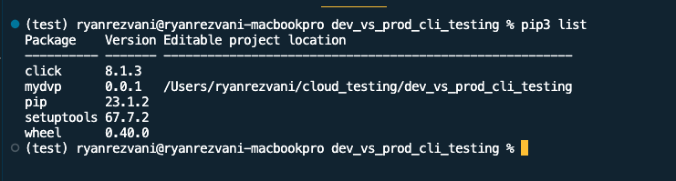

# Quickstart

## Install / Setup

### [1] Create a virtual 'test' environment
```
$ virtualenv test   
$ source test/bin/activate         
```

### [2] Install the 'mydvp' package
```
$ pip3 install --editable .  
```

### [3] Confirm Initial Packages



# Demo 

## CLI Skeleton / how to run:
- [Skeleton of CLI](https://screencast.googleplex.com/cast/NDg0MTUzNzQ0ODk2ODE5Mnw1OGY1ZWJmZi00OQ)
- Example comamnds: 
  - `mydvp init` : Commands here will be used to set up instances and environment
  - `mydvp run`: Commands here will be involved with running the dashboard/Look checkers


# CLI Flows

## [1] init 
Used to set up the instance + environment (dev or prod). There are two ways of setting up the cli, either through a guided, user-input `[A] Setup` 

### [A] Setup
Run setup via user inputs within the command line. Unless you are frequently switching the branch / project, user's will only have to run the `init setup` commands infrequently. Setup values are stored to a yaml file which will be used during the `run` comamnds

#### `Setup` Flow
- See Recording: TBD

### [B] CLI
Skips the guided setup and allows users to enter in the instance + environment information as command line args. For users running automated bash type scripts, this will likely be the preferred method if they are switching between branches, projects, and instances frequently.

####  `CLI` Flow
- See Recording: TBD