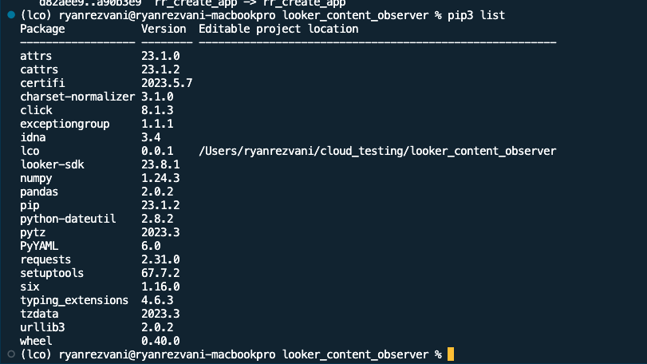

# Looker Content Observer (LCO)

# Quickstart

## [Pre-Step] looker.ini File
The Looker Content Observer leverages Looker's API to programatically check the data from dashboards. In order to accompolish this, the API credentialy will need to be set up in advance in a 'looker.ini' file.

The project includes a sample looker.ini file here: 
 - [Example of looker.ini file](looker_example.ini)
 - **Note**: The looker.ini file contains multiple sections, each section is associated with the API credentials of an individual instance.


### Resources to Set up looker.ini File
- [See Configuring the SDK](https://developers.looker.com/api/getting-started)
- [What are INI Files](https://www.advancedinstaller.com/what-is-ini-file.html)
- [Setup User's API Credentials](https://cloud.google.com/looker/docs/api-auth)


## Install / Setup

### [1] Create a virtual 'test' environment
```
$ virtualenv lco   
$ source lco/bin/activate         
```

### [2] Install the 'lco' package
```
$ pip3 install --editable .  
```

### [3] Confirm Initial Packages



# Demo 

## CLI Skeleton / how to run:
- Example comamnds: 
  - `lco init` : Commands here will be used to set up instances and environment
    - For the first time running the script, users should `init` as the first step
  - `lco run`: Commands here will be involved with running the dashboard/Look checkers
    - Run leverages the file created from the init phase 
- If one instance+branch is added during `init`, the tool will check content against that one instance+branch upon `lco run dash`. If two or more are added during `init`, the tool will check and also compare all instance+branch runs to each other during `lco run dash`.


# CLI Flows

## [1] init 
Used to set up the instance + environment (dev or prod). There are two ways of setting up the cli, either through a guided, user-input `[A] Setup`, or through a single CLI command `[B] CLI`. Either method creates or overwrites the '/configs/instance_environment_configs.yaml' file.

### [A] Setup
Run setup via user inputs within the command line. Unless you are frequently switching the branch / project, user's will only have to run the `init setup` commands infrequently. Setup values are stored to a yaml file which will be used during the `run` comamnds

#### `Setup` Flow


- See Recording: **[lco init](https://screencast.googleplex.com/cast/NjQ3NDc0MTcxMjk0NTE1MnwwNzE1ZDllZC00Ng)**

### [B] CLI
Skips the guided setup and allows users to enter in the instance + environment information as command line args. For users running automated bash type scripts, this will likely be the preferred method if they are switching between branches, projects, and instances frequently.

####  `CLI` Flow
- See Recording: TBD
- Example setting up two runs, one on the production branch of an instance called MyInstance (as named in looker.ini), and a second on the my_dev_branch branch of my_test_project project in the AnotherInstance instance: 
`lco init cli -i MyInstance production -i AnotherInstance my_test_project::my_dev_branch `
  - Note: Always use two colons '::' to between the project and branch, i.e. project::branch

## [2] run

### [A] me
Running command `run me` will test the 'looker.ini' and 'instance_environment_configs.yaml' files. 

### [B] dash
- This runs the Looker Content Observer against a dashboard
- Set the desired tests in '/config/config_tests.yaml'
- An example command would be `lco run dash -d 17 -d 18 --csv mydashresults`. This would run the tool against dashboards 17 and 18 and save the results to '/outputs/mydashresults_hh_mm_ss_dd_yyyy' with the suffix containing the time and date of the run in UTC.
- If run from a different folder than the location of 'looker.ini', the additional command `-f --looker-file-path PATH` is needed 

### [C] look
- This runs the Looker Content Observer against a Look
- Set the desired tests in '/config/config_tests.yaml'
- An example command would be `lco run look -l 17 -l 18 --csv mylookresults`. This would run the tool against Looks 17 and 18 and save the results to '/outputs/mylookresults_hh_mm_ss_dd_yyyy' with the suffix containing the time and date of the run in UTC.
- If run from a different folder than the location of 'looker.ini', the additional command `-f --looker-file-path PATH` is needed 